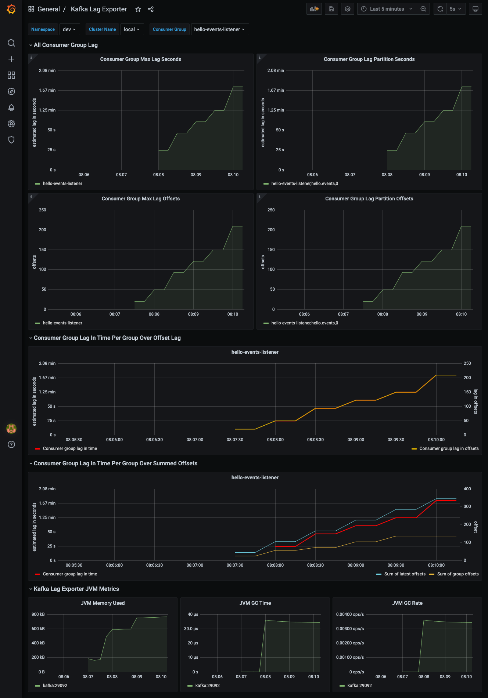
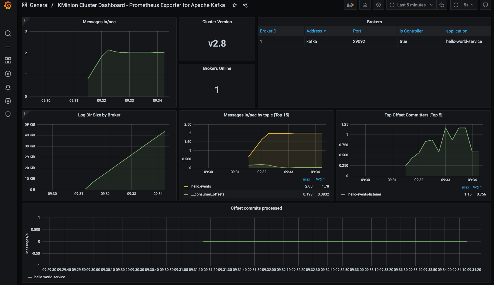
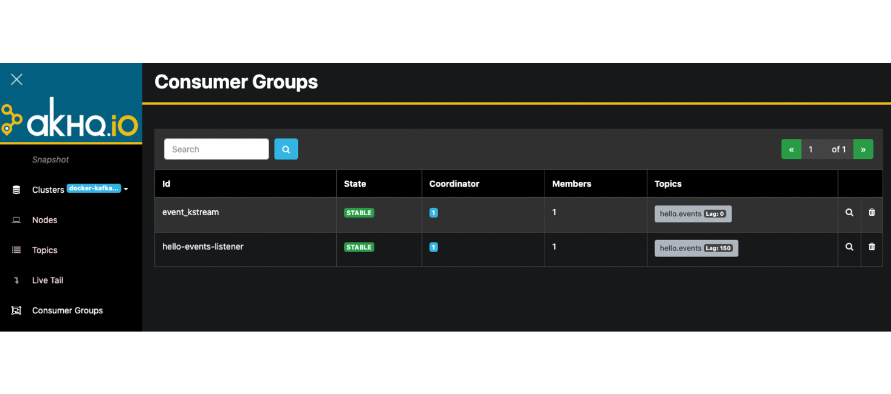

# Monitoring tools for Apache Kafka ecosystem (PoC)

The goal of this example project is to demonstrate different approaches to monitor Apache Kafka ecosystem.

## Caution

The examples in this repository are only for testing purposes only.

## Getting Started

This repository contains multiple docker-compose stacks which includes all necessary monitoring infrastructure setup.

Each sample demonstrates how to collect and monitor useful metrics and visualize records using various types of tools
available online.

Docker compose stacks can be found under [docker](./docker) directory.

### Build and Install

Please refer to the individual readme files for further instructions how to build/install selected monitoring demo.

**Available demos:**

* [Confluent Platform Community Edition](docker/cp-community-monitoring)
  <table>
    <tr>
      <td>Kafka Overview</td>
       <td>Kafka Topics</td>
       <td>Kafka Connect Overview</td>
    </tr>
    <tr>
      <td></td>
      <td> </td>
      <td></td>
    </tr>
   </table>
  <table>
    <tr>
      <td>Schema Registry Overview</td>
       <td>ksqldb Overview</td>
       <td>Zookeeper Overview</td>
    </tr>
    <tr>
      <td></td>
      <td> </td>
      <td></td>
    </tr>
   </table>

  <table>
    <tr>
      <td>Kafka Lag Exporter</td>
    </tr>
    <tr>
      <td></td>
    </tr>
   </table>
  
* [Burrow](./docker/burrow)
  <table>
    <tr>
    <td>Burrow Dashboard - Home Page</td>
    <td>BurrowUI - Home Page</td>
    <td>BurrowUI - Total Lag Graph</td>
    </tr>
    <tr>
    <td></td>
    <td> </td>
    <td></td>
    </tr>
  </table>

* [Kafka Lag Exporter](./docker/kafka-lag-exporter)
  <table>
    <tr>
      <td>Grafana Kafka Lag Exporter</td>
    </tr>
    <tr>
      <td></td>
    </tr>
   </table>  

* [KMinion](./docker/kminion)
  <table>
    <tr>
      <td>Cluster Dashboard </td>
       <td>Consumer Group Dashboard</td>
       <td>Topic Dashboard</td>
    </tr>
    <tr>
      <td></td>
      <td> </td>
      <td></td>
    </tr>
   </table>

* [Kowl - Apache Kafka Web UI](./docker/kowl)

  <table>
    <tr>
    <td>Kowl - Topics Page</td>
    <td>Kowl - Consumer Groups</td>
    </tr>
    <tr>
    <td></td>
    <td> </td>
    </tr>
  </table>

* [AKHQ (KafkaHQ) - Apache Kafka Web UI](./docker/kafkahq)

  <table>
    <tr>
    <td>KafkaHQ</td>
    </tr>
    <tr>
    <td></td>
    </tr>
  </table>

## References

* [Monitoring Your Event Streams: Integrating Confluent with Prometheus and Grafana](https://www.confluent.io/blog/monitor-kafka-clusters-with-prometheus-grafana-and-confluent/)
* [Prometheus](https://prometheus.io/)
* [ksqlDB](https://github.com/confluentinc/ksql)
* [Schema Registry](https://github.com/confluentinc/schema-registry)
* [Kafka REST Proxy](https://github.com/confluentinc/kafka-rest)
* [Kafka Connect](https://github.com/confluentinc/kafka-images/tree/master/kafka-connect)
  
* [Linkedin/Burrow](https://github.com/linkedin/Burrow)
* [GeneralMills/BurrowUI](https://github.com/GeneralMills/BurrowUI)
* [Joway/BurrowDashboard](https://github.com/joway/burrow-dashboard)

* [Lightbend Kafka Lag Exporter](https://github.com/lightbend/kafka-lag-exporter)
* [Kafka Lag Exporter Grafana Dashboard](https://github.com/lightbend/kafka-lag-exporter/blob/master/grafana/Kafka_Lag_Exporter_Dashboard.json)

* [tchiotludo/akhq](https://github.com/tchiotludo/akhq)

* [KMinion - Prometheus Exporter for Apache Kafka](https://github.com/cloudhut/kminion)
* [KMinion Cluster Dashboard](https://grafana.com/grafana/dashboards/14012)
* [KMinion Consumer Group Dashboard](https://grafana.com/grafana/dashboards/14014)
* [KMinion Topic Dashboard](https://grafana.com/grafana/dashboards/14013)

* [cloudhut/kowl](https://github.com/cloudhut/kowl)

## License

Distributed under the MIT License. See `LICENSE` for more information.