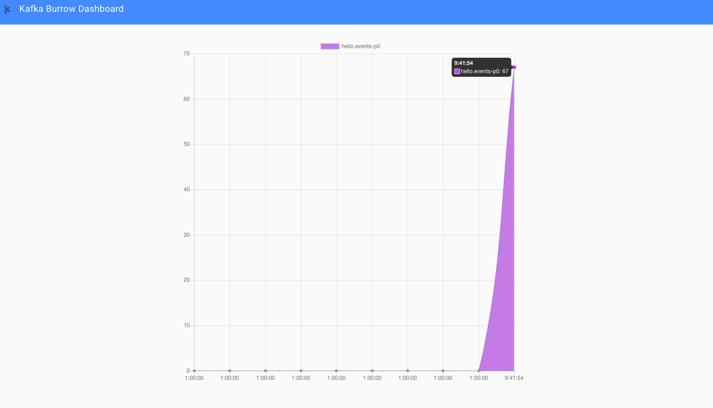

# Burrow - consumer lag monitoring demo.

This sample demonstrates how to monitor consumer lag using LinkedIn Burrow and visualize metrics via Burrow Dashboard or
BurrowUI.

## Components

* [Kafka Lag Exporter](https://github.com/linkedin/Burrow)

## Dashboards

<table>
  <tr>
  <td>Burrow Dashboard - Home Page</td>
  <td>BurrowUI - Home Page</td>
  <td>BurrowUI - Total Lag Graph</td>
  </tr>
  <tr>
  <td></td>
  <td> </td>
  <td></td>
  </tr>
</table>

## Getting Started

### Prerequisite

* Java 11
* Docker

### Build

* Run below command to build **linkedin/burrow** docker image:
    ```shell
    # Download burrow source code
    curl -L https://github.com/linkedin/Burrow/archive/refs/tags/v1.3.6.zip | tar zx
    
    # Build docker image locally
    (cd Burrow-1.3.6 && docker build . -t linkedin/burrow:v1.3.6)
    
    # Remove downloaded source code
    rm -R Burrow-1.3.6
    ```

* Build sample Kafka application using below command:
  ```shell
  ./gradlew bootBuildImage
  ```

### Usage

* Run the docker compose stack.
  ```shell
  cd ./docker/burrow
  docker compose up -d
  ```

* Check if all components are healthy.
  ```shell
  docker compose ps
  
  #   NAME                   SERVICE                STATUS              PORTS
  # burrow                 burrow                 running             0.0.0.0:8005->8000/tcp, :::8005->8000/tcp
  # burrow-dashboard       burrow-dashboard       running             0.0.0.0:8006->80/tcp, :::8006->80/tcp
  # burrowUI               burrowUI               running             0.0.0.0:8007->3000/tcp, :::8007->3000/tcp
  # kafka                  kafka                  running             0.0.0.0:9092->9092/tcp, :::9092->9092/tcp, 0.0.0.0:9101->9101/tcp, :::9101->9101/tcp
  # kafka-monitoring-app   kafka-monitoring-app   running             0.0.0.0:7777->7777/tcp, :::7777->7777/tcp
  # zookeeper              zookeeper              running             0.0.0.0:2181->2181/tcp, :::2181->2181/tcp, 2888/tcp, 3888/tcp
  ```

* Check [available clusters](http://localhost:8005/v3/kafka) inside Burrow.

* Visit [http://localhost:8005/v3/kafka/local/consumer/hello-events-listener/lag](http://localhost:8005/v3/kafka/local/consumer/hello-events-listener/lag) to check lag for `hello-events-listener` consumer group.

* Open your web browser and go to:
    * [Burrow Dashboard](http://localhost:8006)
    * [BurrowUI](http://localhost:8007)

* Stop docker compose stack.
  ```shell
  docker compose down -v
  ```

## Important Endpoints

| Name | Endpoint | 
| -------------:|:--------:|
| `Burrow` | [http://localhost:8005/](http://localhost:8005/) |
| `Burrow Dashboard` | [http://localhost:8006](http://localhost:8006) |
| `BurrowUI` | [http://localhost:8007](http://localhost:8007) |

## References

* [Linkedin/Burrow](https://github.com/linkedin/Burrow)
  
* [GeneralMills/BurrowUI](https://github.com/GeneralMills/BurrowUI)
  
* [Joway/BurrowDashboard](https://github.com/joway/burrow-dashboard)