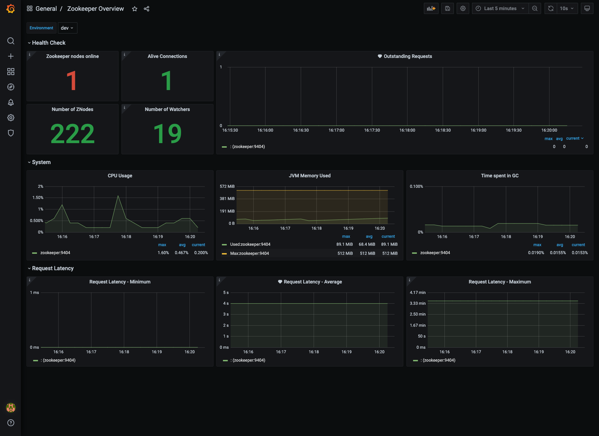

# Confluent Platform Community Edition - monitoring demo.

This sample demonstrates how to monitor Confluent Platform Community Edition components and visualize metrics in Grafana
dashboards.

Grafana dashboards used in this demo can be found [here](./config/grafana/provisioning/dashboards)

## Components

* [Prometheus](https://prometheus.io/)
* [Grafana](https://grafana.com/)
* [Kafka Lag Exporter](https://github.com/lightbend/kafka-lag-exporter)
* [ksqlDB](https://ksqldb.io/)
* [Schema Registry](https://docs.confluent.io/platform/current/schema-registry/index.html)
* [Kafka REST Proxy](https://docs.confluent.io/platform/current/kafka-rest/index.html)
* [Kafka Connect](https://docs.confluent.io/platform/current/connect/index.html)

## Dashboards

  <table>
    <tr>
      <td>Kafka Overview</td>
       <td>Kafka Topics</td>
       <td>Kafka Connect Overview</td>
    </tr>
    <tr>
      <td></td>
      <td> </td>
      <td></td>
    </tr>
   </table>
  <table>
    <tr>
      <td>Schema Registry Overview</td>
       <td>ksqldb Overview</td>
       <td>Zookeeper Overview</td>
    </tr>
    <tr>
      <td></td>
      <td> </td>
      <td></td>
    </tr>
   </table>

  <table>
    <tr>
      <td>Kafka Lag Exporter</td>
    </tr>
    <tr>
      <td></td>
    </tr>
   </table>

## Getting Started

### Prerequisites

* Java 11
* Docker

### Build

* Build sample Kafka application using below command:
  ```shell
  ./gradlew bootBuildImage
  ```

### Usage

* Run the docker compose stack.
  ```shell
  cd ./docker/cp-community-monitoring
  docker compose up -d
  ```

* Check if all components are running.
  ```shell
  docker compose ps
  
  # NAME                   SERVICE                STATUS              PORTS
  # connect                connect                running (healthy)   0.0.0.0:8083->8083/tcp, :::8083->8083/tcp, 9092/tcp
  # grafana                grafana                running (healthy)   0.0.0.0:3000->3000/tcp, :::3000->3000/tcp
  # kafka                  kafka                  running             0.0.0.0:9092->9092/tcp, :::9092->9092/tcp, 0.0.0.0:9101->9101/tcp, :::9101->9101/tcp
  # kafka-lag-exporter     kafka-lag-exporter     running             0.0.0.0:8000->8000/tcp, :::8000->8000/tcp
  # kafka-monitoring-app   kafka-monitoring-app   running             0.0.0.0:7777->7777/tcp, :::7777->7777/tcp
  # ksqldb-cli             ksqldb-cli             running             
  # ksqldb-server          ksqldb-server          running             0.0.0.0:8088->8088/tcp, :::8088->8088/tcp
  # prometheus             prometheus             running (healthy)   0.0.0.0:9090->9090/tcp, :::9090->9090/tcp
  # rest-proxy             rest-proxy             running             0.0.0.0:8082->8082/tcp, :::8082->8082/tcp
  # schema-registry        schema-registry        running             0.0.0.0:8081->8081/tcp, :::8081->8081/tcp
  ```

* Open your web browser and go to Grafana [login page](http://localhost:3000/).
    * Username: `admin`
    * Password: `password`

* Investigate Grafana dashboards:
    * **Kafka Overview**
    * **Kafka Topics**
    * **Kafka Connect Overview**
    * **Schema Registry Overview**
    * **ksqldb Overview**
    * **Zookeeper Overview**
    * **Kafka Lag Exporter**

* Stop docker compose stack.
  ```shell
  docker compose down -v
  ```

## Important Endpoints

| Name | Endpoint | 
| -------------:|:--------:|
| `Grafana` | [http://localhost:3000/](http://localhost:3000/) |
| `Prometheus` | [http://localhost:9090/](http://localhost:9090/) |

## References

* [Monitoring Your Event Streams: Integrating Confluent with Prometheus and Grafana](https://www.confluent.io/blog/monitor-kafka-clusters-with-prometheus-grafana-and-confluent/)
* [Prometheus](https://prometheus.io/)
* [Grafana](https://grafana.com/)
* [Kafka Lag Exporter](https://github.com/lightbend/kafka-lag-exporter)
* [ksqlDB](https://github.com/confluentinc/ksql)
* [Schema Registry](https://github.com/confluentinc/schema-registry)
* [Kafka REST Proxy](https://github.com/confluentinc/kafka-rest)
* [Kafka Connect](https://github.com/confluentinc/kafka-images/tree/master/kafka-connect)
