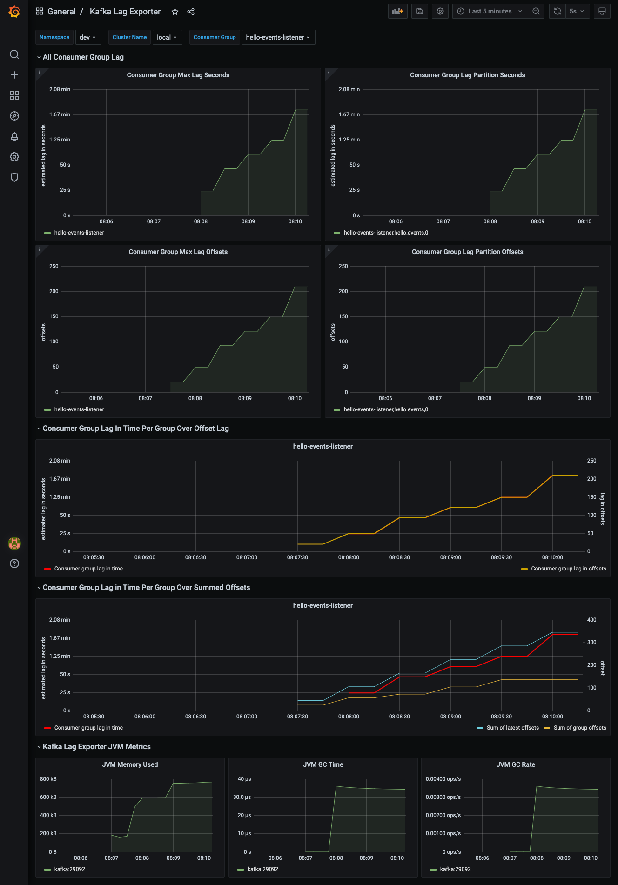

# Kafka Lag Exporter - consumer lag monitoring demo.

This sample demonstrates how to monitor consumer lag using `Kafka Lag Exporter` and visualize metrics via Grafana.

Grafana dashboard used in this demo can be found [here](./config/grafana/provisioning/dashboards)

## Components

* [Kafka Lag Exporter](https://github.com/lightbend/kafka-lag-exporter)
* [Prometheus](https://prometheus.io/)
* [Grafana](https://grafana.com/)

## Dashboards



## Getting Started

### Prerequisite

* Java 11
* Docker

### Build

* Build sample Kafka application using below command:
  ```shell
  ./gradlew bootBuildImage
  ```

### Usage

* Run the docker compose stack.
  ```shell
  cd ./docker/kafka-lag-exporter
  docker compose up -d
  ```

* Check if all components are healthy.
  ```shell
  docker compose ps

  # NAME                   SERVICE                STATUS              PORTS
  # grafana                grafana                running (healthy)   0.0.0.0:3000->3000/tcp, :::3000->3000/tcp
  # kafka                  kafka                  running             0.0.0.0:9092->9092/tcp, :::9092->9092/tcp, 0.0.0.0:9101->9101/tcp, :::9101->9101/tcp
  # kafka-lag-exporter     kafka-lag-exporter     running             0.0.0.0:8000->8000/tcp, :::8000->8000/tcp
  # kafka-monitoring-app   kafka-monitoring-app   running             0.0.0.0:7777->7777/tcp, :::7777->7777/tcp
  # prometheus             prometheus             running (healthy)   0.0.0.0:9090->9090/tcp, :::9090->9090/tcp
  # zookeeper              zookeeper              running             0.0.0.0:2181->2181/tcp, :::2181->2181/tcp, 2888/tcp, 3888/tcp
  ```

* Open your web browser and go to Grafana [login page](http://localhost:3000/).
    * Username: `admin`
    * Password: `password`

* Open **Kafka Lag Exporter** dashboard and investigate exposed metrics.

* Stop docker compose stack.
  ```shell
  docker compose down -v
  ```

## Important Endpoints

| Name | Endpoint | 
| -------------:|:--------:|
| `Kafka Lag Exporter - Metric endpoint` | [http://localhost:8000/](http://localhost:8000/) |
| `Grafana` | [http://localhost:3000/](http://localhost:3000/) |
| `Prometheus` | [http://localhost:9090/](http://localhost:9090/) |

## References

* [Lightbend Kafka Lag Exporter](https://github.com/lightbend/kafka-lag-exporter)
* [Kafka Lag Exporter Grafana Dashboard](https://github.com/lightbend/kafka-lag-exporter/blob/master/grafana/Kafka_Lag_Exporter_Dashboard.json)
* [Prometheus](https://prometheus.io/)
* [Grafana](https://grafana.com/)
