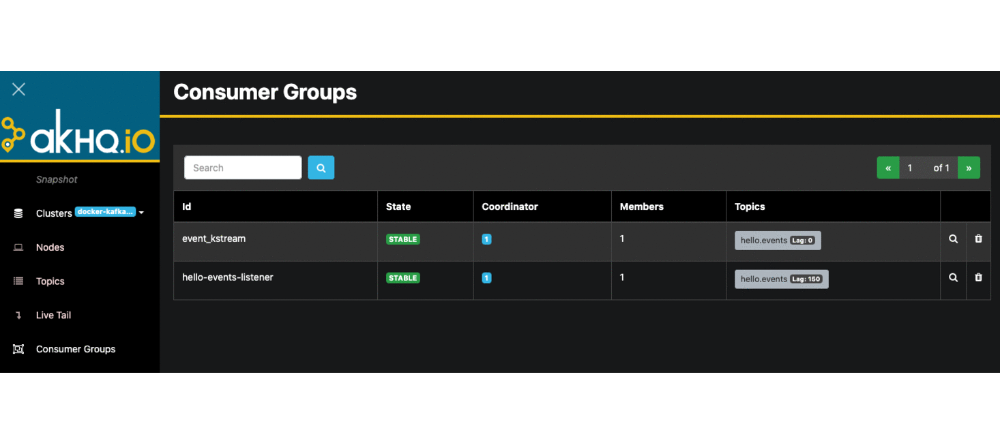

# AKHQ (KafkaHQ) - Web UI for local Apache Kafka management and development

This sample demonstrates how to explore messages, consumers and configurations of Apache Kafka ecosystem using **AKHQ**
Web UI.

## Components

* [AKHQ (KafkaHQ)](https://github.com/tchiotludo/akhq)

## Dashboards



## Getting Started

### Prerequisites

* Java 11
* Docker

### Build

* Build sample Kafka application using below command:
  ```shell
  ./gradlew bootBuildImage
  ```

### Usage

* Run the docker compose stack.
  ```shell
  cd ./docker/kafkahq
  docker compose up -d
  ```

* Check if all components are running.
  ```shell
  docker compose ps
  
  # NAME                   SERVICE                STATUS              PORTS
  # akhq                   akhq                   running             0.0.0.0:8080->8080/tcp, :::8080->8080/tcp
  # connect                connect                running (healthy)   8083/tcp, 9092/tcp
  # kafka                  kafka                  running             0.0.0.0:9092->9092/tcp, :::9092->9092/tcp, 0.0.0.0:9101->9101/tcp, :::9101->9101/tcp
  # kafka-monitoring-app   kafka-monitoring-app   running             0.0.0.0:7777->7777/tcp, :::7777->7777/tcp
  # schema-registry        schema-registry        running             8081/tcp
  # zookeeper              zookeeper              running             2888/tcp, 3888/tcp, 0.0.0.0:2181->2181/tcp, :::2181->2181/tcp
  ```

* Open your web browser and go to [AKHQ Web UI](http://localhost:8080/).

* Stop docker compose stack.
  ```shell
  docker compose down -v
  ```

## Important Endpoints

| Name | Endpoint | 
| -------------:|:--------:|
| `AKHQ Web UI` | [http://localhost:8080/](http://localhost:8080/) |

## References

* [tchiotludo/akhq](https://github.com/tchiotludo/akhq)
