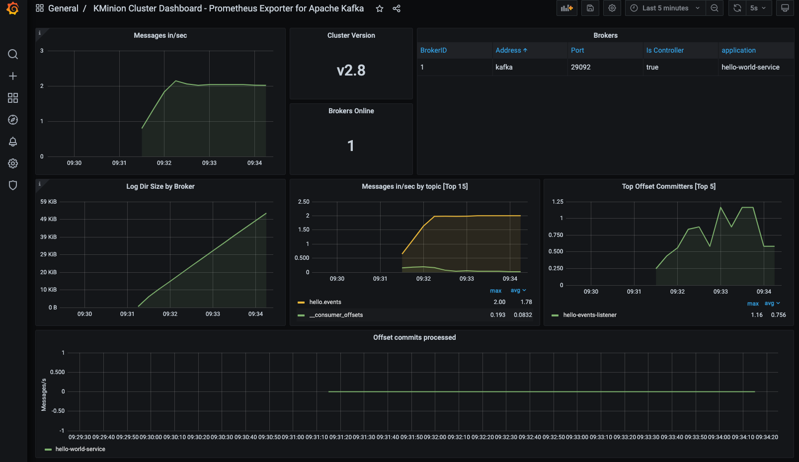

# KMinion - monitoring demo.

This sample demonstrates how to monitor Apache Kafka cluster using `KMinion` and visualize metrics in Grafana
dashboards.

Grafana dashboards used in this demo can be found [here](./config/grafana/provisioning/dashboards)

## Components

* [KMinion](https://github.com/cloudhut/kminion)
* [Prometheus](https://prometheus.io/)
* [Grafana](https://grafana.com/)

## Dashboards

  <table>
    <tr>
      <td>Cluster Dashboard </td>
       <td>Consumer Group Dashboard</td>
       <td>Topic Dashboard</td>
    </tr>
    <tr>
      <td></td>
      <td> </td>
      <td></td>
    </tr>
   </table>

## Getting Started

### Prerequisite

* Java 11
* Docker

### Build

* Build sample Kafka application using below command:
  ```shell
  ./gradlew bootBuildImage
  ```

### Usage

* Run the docker compose stack.
  ```shell
  cd ./docker/kminion
  docker compose up -d
  ```

* Check if all components are running.
  ```shell
  docker compose ps

  #   NAME                   SERVICE                STATUS              PORTS
  # grafana                grafana                running (healthy)   0.0.0.0:3000->3000/tcp, :::3000->3000/tcp
  # kafka                  kafka                  running             0.0.0.0:9092->9092/tcp, :::9092->9092/tcp, 0.0.0.0:9101->9101/tcp, :::9101->9101/tcp
  # kafka-minion           kafka-minion           running             0.0.0.0:8080->8080/tcp, :::8080->8080/tcp
  # kafka-monitoring-app   kafka-monitoring-app   running             0.0.0.0:7777->7777/tcp, :::7777->7777/tcp
  # prometheus             prometheus             running (healthy)   0.0.0.0:9090->9090/tcp, :::9090->9090/tcp
  # zookeeper              zookeeper              running             0.0.0.0:2181->2181/tcp, :::2181->2181/tcp, 2888/tcp, 3888/tcp
  ```

* Open your web browser and go to Grafana [login page](http://localhost:3000/).
    * Username: `admin`
    * Password: `password`

* Investigate Grafana dashboards:
  * **KMinion Cluster Dashboard - Prometheus Exporter for Apache Kafka**
  * **KMinion Consumer Group Dashboard - Prometheus Exporter for Apache Kafka**
  * **KMinion Topic Dashboard - Prometheus Exporter for Apache Kafka**

* Stop docker compose stack.
  ```shell
  docker compose down -v
  ```

## Important Endpoints

| Name | Endpoint | 
| -------------:|:--------:|
| `Kminion` | [http://localhost:8080/](http://localhost:8080/) |
| `Kminion - Prometheus Metrics` | [http://localhost:8080/metrics](http://localhost:8080/metrics) |
| `Grafana` | [http://localhost:3000/](http://localhost:3000/) |
| `Prometheus` | [http://localhost:9090/](http://localhost:9090/) |

## References

* [KMinion - Prometheus Exporter for Apache Kafka](https://github.com/cloudhut/kminion)
* [KMinion Cluster Dashboard](https://grafana.com/grafana/dashboards/14012)
* [KMinion Consumer Group Dashboard](https://grafana.com/grafana/dashboards/14014)
* [KMinion Topic Dashboard](https://grafana.com/grafana/dashboards/14013)
* [Prometheus](https://prometheus.io/)
* [Grafana](https://grafana.com/)
