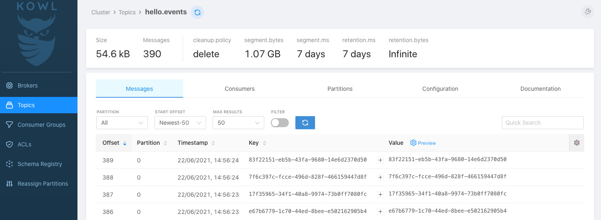
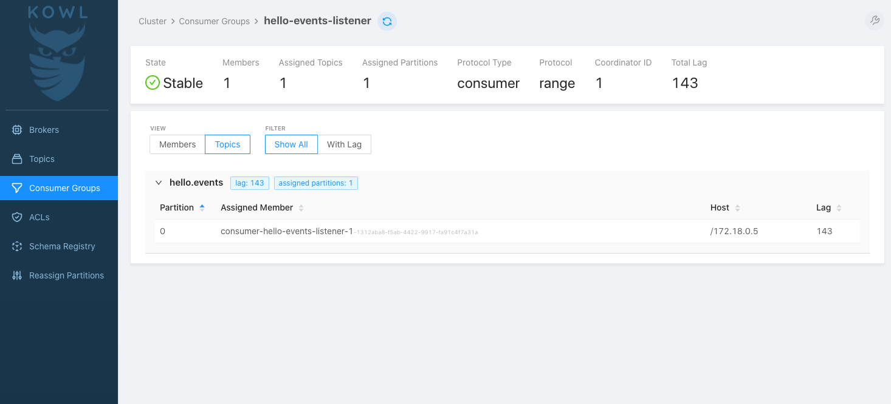

# Kowl - Web UI for local Apache Kafka development

This sample demonstrates how to explore messages, consumers and configurations of Apache Kafka cluster using **Kowl**
Web UI.

## Components

* [Kowl](https://github.com/cloudhut/kowl)

## Dashboards

<table>
  <tr>
  <td>Kowl - Topics Page</td>
  <td>Kowl - Consumer Groups</td>
  </tr>
  <tr>
  <td></td>
  <td> </td>
  </tr>
</table>

## Getting Started

### Prerequisite

* Java 11
* Docker

### Build

* Build sample Kafka application using below command:
  ```shell
  ./gradlew bootBuildImage
  ```

### Usage

* Run the docker compose stack.
  ```shell
  cd ./docker/kowl
  docker compose up -d
  ```

* Check if all components are healthy.
  ```shell
  docker compose ps

  #   NAME                   SERVICE                STATUS              PORTS
  # kafka                  kafka                  running             0.0.0.0:9092->9092/tcp, :::9092->9092/tcp, 0.0.0.0:9101->9101/tcp, :::9101->9101/tcp
  # kafka-monitoring-app   kafka-monitoring-app   running             0.0.0.0:7777->7777/tcp, :::7777->7777/tcp
  # kowl                   kowl                   running             0.0.0.0:8080->8080/tcp, :::8080->8080/tcp
  # zookeeper              zookeeper              running             0.0.0.0:2181->2181/tcp, :::2181->2181/tcp, 2888/tcp, 3888/tcp
  ```

* Open your web browser and go to [Kowl Web UI](http://localhost:8080/).

* Stop docker compose stack.
  ```shell
  docker compose down -v
  ```

## Important Endpoints

| Name | Endpoint | 
| -------------:|:--------:|
| `Kowl Web UI` | [http://localhost:8080/](http://localhost:8080/) |

## References

* [cloudhut/kowl](https://github.com/cloudhut/kowl)
